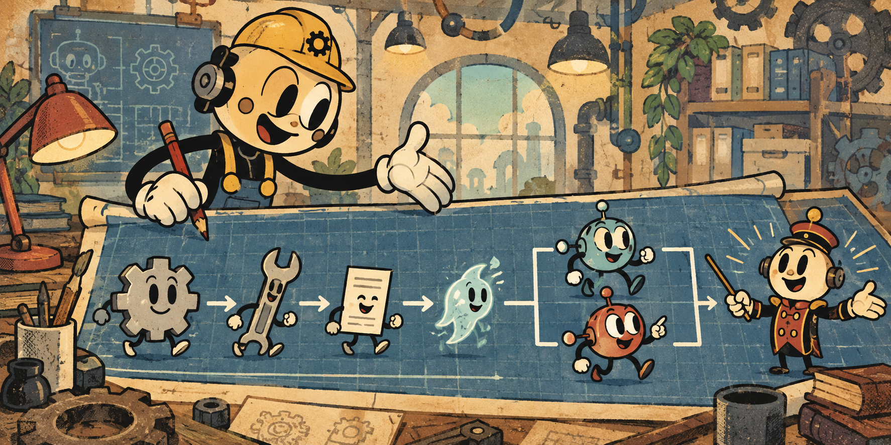

# Проектировщик архитектуры агентов



[](https://skills.sh/kotlyar/agent-architecture-builder/agent-architecture-builder-ru)
[](https://github.com/kotlyar/agent-architecture-builder/actions/workflows/validate.yml)
[](LICENSE)

[English version](README.md)

Универсальный навык агента, который проводит интервью простым языком и
проектирует минимальную обоснованную систему автономных агентов.

Он определяет, что должно быть постоянной инструкцией, обычным процессом,
инструментом, навыком, временным подагентом, постоянным агентом или
оркестратором. Отдельно выясняет необходимость памяти, базы данных, панели в
браузере, подтверждений, расписаний и внешних связей.

Метод не зависит от профессии, отрасли и платформы. Hermes, Codex, Claude Code и
другие среды являются адаптерами реализации, а не основаниями архитектурного
решения.

## Зачем это нужно

Должность и название продукта плохо определяют границы системы. Одна названная
роль может оказаться одним агентом с несколькими навыками, несколькими
независимыми агентами или обычным процессом без агента. Поэтому навык сначала
восстанавливает реальную работу, а затем применяет явные условия.

Порядок выбора:

```text
обычный процесс → инструмент → навык → подагент → постоянный агент → оркестратор
```

Для постоянного агента обязательны три условия владения и хотя бы одно условие
изоляции:

```text
постоянный_агент = P1 И P2 И P3 И (I1 ИЛИ I2 ИЛИ I3 ИЛИ I4 ИЛИ I5 ИЛИ I6)
```

- `P1` — собственный долгоживущий результат;
- `P2` — собственное сохраняемое состояние;
- `P3` — независимый жизненный цикл;
- `I1–I6` — отдельные учётная запись, полномочия, данные, эксплуатация,
  контекст или постоянная параллельная нагрузка.

Оркестратор допустим только при наличии хотя бы двух обоснованных постоянных
агентов, общего результата, реальной обязанности согласования и смыслового
выбора, который нельзя заменить устойчивыми правилами.

## Интервью

Пользователю не нужно знать термины архитектуры. Навык задаёт один главный вопрос
за ход, начиная с желаемого изменения и конкретного рабочего случая. Если на
широкий вопрос трудно ответить, он предлагает необязательные примеры на основе
слов и области самого пользователя.

Перед каждым главным вопросом навык показывает ход интервью:

Создание агента · этап 2 из 7

```text
[✓ ● ○ ○ ○ ○ ○]
```

```text
✓ Пройдено: цель и успех
● Сейчас: реальная работа
○ Далее: состав работ
```

Семь этапов: цель и успех, реальная работа, состав работ, самостоятельность и
управление, ограничения и среда, архитектура, комплект реализации. Продвижение
считается по завершённым смысловым этапам, а не по числу сообщений. Навык не
показывает обманчивый процент готовности и не обещает точное число вопросов.

Интервью также выясняет:

- как начинается работа и что считается законченным результатом;
- что нужно сохранять между запусками и кто этим владеет;
- какие действия подтверждает человек;
- как человеку удобнее управлять системой;
- нужно ли общее состояние нескольким людям;
- в каких средах должна работать реализация.

## Результат

После прохождения условий готовности навык создаёт самодостаточный каталог и
архив `.zip`, содержащие:

- требования и основания;
- независимую от платформы архитектуру;
- журнал решений и отвергнутых вариантов;
- устройство состояния, полномочий, интерфейса и хранилища;
- адаптер каждой выбранной среды;
- спецификации компонентов;
- критерии и сценарии приёмки;
- одно задание `IMPLEMENTATION.md` для реализующего агента;
- автоматическую проверку и контрольные суммы.

Упаковщик поддерживает произвольные платформы. Для каждой выбранной среды нужен
локальный адаптер; перечень названий не зашит в программу.

## Состав

| Путь | Язык | Имя навыка |
|---|---|---|
| `skills/agent-architecture-builder-ru/` | Русский | `agent-architecture-builder-ru` |
| `skills/agent-architecture-builder/` | Английский | `agent-architecture-builder` |

Устанавливайте только нужную языковую версию, чтобы не загружать два описания
одной возможности в исходный контекст агента.

## Установка

Общая команда для разных агентов:

```bash
npx skills add kotlyar/agent-architecture-builder
```

Codex для всех проектов пользователя:

```bash
mkdir -p ~/.agents/skills
cp -R skills/agent-architecture-builder-ru ~/.agents/skills/
```

Для одного проекта Codex скопируйте каталог в `.agents/skills/`.

Claude Code для всех проектов пользователя:

```bash
mkdir -p ~/.claude/skills
cp -R skills/agent-architecture-builder-ru ~/.claude/skills/
```

Для одного проекта Claude Code скопируйте каталог в `.claude/skills/`.

Установка плагина Claude Code из этого репозитория:

```text
/plugin marketplace add kotlyar/agent-architecture-builder
/plugin install agent-architecture-builder@agent-architecture-builder
```

Явный вызов:

- отдельный навык Codex: `$agent-architecture-builder-ru`;
- отдельный навык Claude Code: `/agent-architecture-builder-ru`;
- навык внутри плагина Claude Code:
  `/agent-architecture-builder:agent-architecture-builder-ru`.

Обе среды также могут выбрать навык автоматически по его описанию.

## Поддерживаемые адаптеры

Сейчас включены справочные адаптеры для Hermes, Codex и Claude Code. Новая среда
добавляется отдельным файлом в `references/platforms/`; универсальные правила
решений при этом не меняются.

## Проверка

```bash
python scripts/validate_repository.py
```

Проверяются обе языковые версии, манифесты плагинов, адаптеры платформ,
метаданные, схема комплекта, поддержка произвольной платформы, защита от секретов
и создание архива.

## Версия 2

Версия 2 заменяет прежние имена `hermes-agent-builder` и
`hermes-agent-builder-en`. Hermes остаётся поддерживаемым адаптером, а ядро и
создаваемый комплект становятся независимыми от платформы.

## Лицензия и безопасность

MIT. Перед установкой проверяйте создаваемые файлы и запрашиваемые полномочия. Не
помещайте учётные данные, приватную память и рабочие данные в навык или комплект
реализации. См. [SECURITY.md](SECURITY.md).

История версий: [CHANGELOG.md](CHANGELOG.md).
